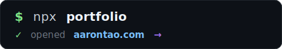
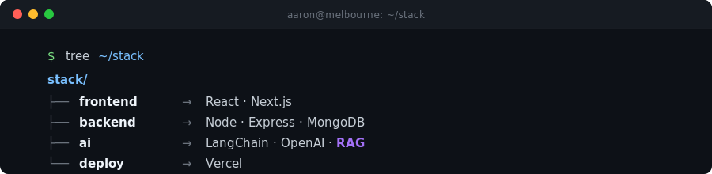
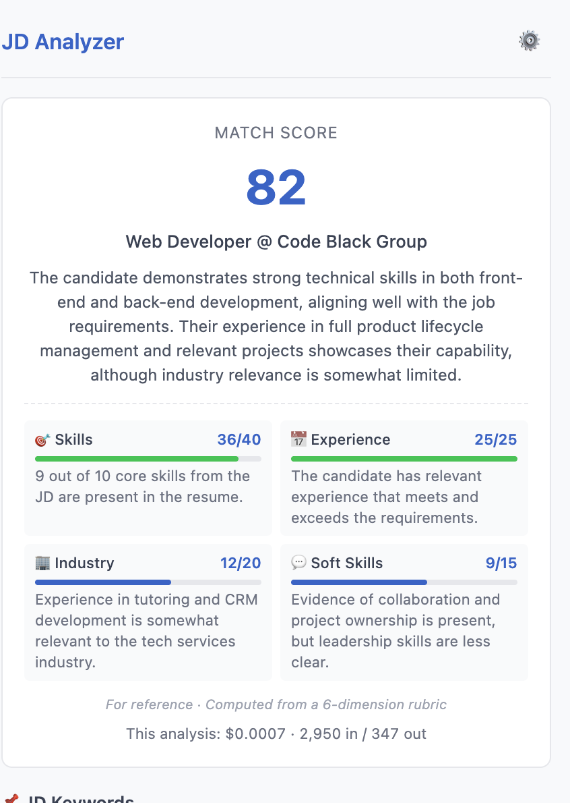

  

  

  
  
  

  

<h2 align="center">🧠 How I work</h2>

  
    <b>Curious by default, careful in production</b> &nbsp;·&nbsp;
    <b>Ship small, learn faster</b> &nbsp;·&nbsp;
    <b>Comfortable saying "I don't know yet"</b>
  

<h2 align="center">🛠️ Stack</h2>

  

<h2 align="center">🚀 DocuMind <i>— featured project</i></h2>

  <i>Multi-tenant RAG SaaS — upload a PDF, ask questions, get streamed answers with inline citations.</i> 
  <b>Why I built it:</b> to learn production-grade RAG end-to-end — not a notebook demo, but auth, multi-tenancy, vector search, and streaming UX wired together. 
  <b>Hardest part:</b> chunking strategy for mixed PDFs (tables + prose) — landed on a hybrid semantic + size-based approach.

  

  
  

<h2 align="center">🧩 JD Analyzer <i>— side project, live on Chrome Web Store</i></h2>

  <i>Chrome extension that scores your resume against any job description in one click.</i> 
  <b>Design choice:</b> BYO OpenAI key, zero backend — users' resumes never touch my server.

  

  

  <i>Full archive on <a href="https://www.aarontao.com/"><b>aarontao.com</b></a> · all repos on <a href="https://github.com/HAONANTAO?tab=repositories"><b>GitHub</b></a></i>

  <picture>
    <source media="(prefers-color-scheme: dark)" srcset="https://raw.githubusercontent.com/HAONANTAO/HAONANTAO/output/github-snake-dark.svg" />
    <source media="(prefers-color-scheme: light)" srcset="https://raw.githubusercontent.com/HAONANTAO/HAONANTAO/output/github-snake.svg" />
    
  </picture>

  <i>Thanks for scrolling. 👋</i> 
  <i>Looking for my first junior AI / full-stack role in <b>Melbourne</b> or remote AU.</i> 
  <i>Aaron Tao &nbsp;·&nbsp; <a href="mailto:taoaaron5@gmail.com">taoaaron5@gmail.com</a> &nbsp;·&nbsp; <a href="https://www.linkedin.com/in/haonan-tao-aaron/">LinkedIn</a></i>

