  

  
  
  
  
  

> 📬 **Open to AI Engineer roles** in Melbourne or remote across Australia.
> Reach me at **taoaaron5@gmail.com** — I usually reply within a day.

<h2 align="center">👋 whoami</h2>

  <b>Aaron — AI Engineer in Melbourne 🇦🇺.</b> 
  I build AI products that <b>ship to real users</b>, not demos for slides.

  🎓 <b>Monash CS</b> &nbsp;·&nbsp; <b>UoM IT</b> &nbsp;·&nbsp; 🇦🇺 <b>Australian PR</b> &nbsp;·&nbsp; 🚢 <b>6+ projects shipped</b> &nbsp;·&nbsp; 📱 <b>1 on App Store</b>

<table align="center">
  <tr>
    <td align="center">🤖 <b>Shipping</b></td>
    <td><a href="https://docu-mind-neon.vercel.app"><b>DocuMind</b></a></td>
    <td>multi-tenant RAG SaaS · token streaming · per-user vector isolation</td>
  </tr>
  <tr>
    <td align="center">🧭 <b>Building</b></td>
    <td><a href="https://github.com/HAONANTAO/skillpath"><b>SkillPath</b></a></td>
    <td>AI Learning Coach · agent-driven roadmaps · adaptive quizzes</td>
  </tr>
  <tr>
    <td align="center">🎯 <b>Going deep on</b></td>
    <td colspan="2">multi-tenant RAG &nbsp;·&nbsp; streaming UX &nbsp;·&nbsp; agent loops</td>
  </tr>
</table>

<h2 align="center">🧭 How I work</h2>

<table align="center">
  <tr>
    <td>🚢 <b>Ship to learn</b></td>
    <td>v1 in production teaches faster than v3 on slides.</td>
  </tr>
  <tr>
    <td>📊 <b>Measure, don't claim</b></td>
    <td><code>&lt;400ms p95</code> is data. "fast" is noise.</td>
  </tr>
  <tr>
    <td>🗺 <b>Diagram first, code second</b></td>
    <td>every project starts with a system sketch — saves rewrites later.</td>
  </tr>
  <tr>
    <td>🤝 <b>AI-paired, human-verified</b></td>
    <td>Claude Code daily — every line gets reviewed before merge.</td>
  </tr>
</table>

<h2 align="center">🛠 Tech Stack</h2>

<table align="center">
  <tr>
    <td align="right"><b>AI / LLM</b></td>
    <td>
      
      
      
      
      
    </td>
  </tr>
  <tr>
    <td align="right"><b>Languages</b></td>
    <td>
      
      
      
    </td>
  </tr>
  <tr>
    <td align="right"><b>Frontend</b></td>
    <td>
      
      
      
      
    </td>
  </tr>
  <tr>
    <td align="right"><b>Backend</b></td>
    <td>
      
      
    </td>
  </tr>
  <tr>
    <td align="right"><b>Data</b></td>
    <td>
      
      
    </td>
  </tr>
  <tr>
    <td align="right"><b>Cloud / DevOps</b></td>
    <td>
      
      
      
      
    </td>
  </tr>
</table>

<h2 align="center">💻 Featured Project</h2>

**🤖 [DocuMind](https://docu-mind-neon.vercel.app)** &nbsp;
AI-powered document Q&A SaaS — upload a PDF, ask questions, get answers with source citations using RAG.

### Architecture

### Request Flow — the SSE edge case, visualized

```mermaid
sequenceDiagram
    autonumber
    actor U as User
    participant API as Express API
    participant P as Pinecone
    participant L as GPT-4o-mini

    U->>API: POST /ask (question + JWT)
    API->>API: verify JWT → userId
    API->>P: vector search (namespace = userId)
    P-->>API: top-k chunks
    API-->>U: 200 OK · SSE headers sent
    API->>L: prompt + retrieved context

    loop token stream
        L-->>API: token
        API-->>U: data: <token>
    end

    rect rgb(60, 30, 30)
    Note over API,L: ⚠️ if LLM crashes mid-stream:<br/>res.headersSent === true → can't send 500.<br/>Push error frame down the open SSE channel<br/>so the frontend never hangs.
    end

    L-->>API: [DONE]
    API-->>U: data: [DONE] · close stream
```

**Highlights**
🔹 **RAG pipeline** — chunk (1k char, 200 overlap) → embed (`text-embedding-3-small`) → **top-5** Pinecone search → `gpt-4o-mini` @ `temperature: 0`
🔹 **Streaming via SSE** — token-by-token · **first token `<{TBD}` ms p95** · full response avg `~{TBD}` s
🔹 **Multi-turn memory** — 6-message rolling window, capped for predictable token budget
🔹 **Per-user isolation** — Pinecone namespace per JWT-extracted `userId` (never user-supplied)
🔹 **Async indexing** — background worker + startup cleanup for orphaned documents

**⚡ Key Engineering Challenges**
🔸 SSE protocol edge case — once HTTP headers are sent, normal error responses are impossible. Solved by detecting `res.headersSent` and pushing LLM crash errors down the open stream so the frontend never hangs mid-response
🔸 Multi-tenancy isolation at two layers: MongoDB queries filter by JWT-extracted `userId` (never user-supplied), Pinecone vectors isolated per-user namespace — delete is atomic (MongoDB first, Pinecone in try-catch) to prevent orphaned vectors on DB failure

**Tech:** React 19, Node.js/Express 5, MongoDB, Pinecone, OpenAI GPT-4o-mini, LangChain, Vercel/Render

<h2 align="center">🚀 More Work</h2>

  A curated slice — full archive on <a href="https://www.aarontao.com/">aarontao.com</a>

  <a href="https://github.com/HAONANTAO/Money_Recorder">
    <h3 align="center">📱 Money Recorder</h3>
  </a>
  
Personal finance iOS app — React Native + Expo, <b>live on the App Store</b>.

  

    
    
  

  
  

<h2 align="center">🐍 Coding Trail</h2>

  <picture>
    <source media="(prefers-color-scheme: dark)" srcset="https://raw.githubusercontent.com/HAONANTAO/HAONANTAO/output/github-snake-dark.svg" />
    <source media="(prefers-color-scheme: light)" srcset="https://raw.githubusercontent.com/HAONANTAO/HAONANTAO/output/github-snake.svg" />
    
  </picture>

  

  <code>$ aaron --status=shipping --location=melbourne --version=2026</code>

  <a href="https://www.aarontao.com/">aarontao.com</a> · <a href="mailto:taoaaron5@gmail.com">taoaaron5@gmail.com</a>

