  

  

  
  
  
  
  

  

---

  

---

<h2 align="center">Tech Stack & AI Tools</h2>

  

  
  
  

  
  
  
  
  
  
  

---

<h2 align="center">🚧 Currently Building</h2>

  

**📚 SkillPath** — AI-powered personalized learning platform. Building in public — watch this space.

---

<h2 align="center">💻 Featured Project</h2>

**🤖 [DocuMind](https://docu-mind-neon.vercel.app)** &nbsp;  
AI-powered document Q&A SaaS — upload a PDF, ask questions, get answers with source citations using RAG.

**Highlights:**  
🔹 RAG pipeline: chunk → embed → vector search → GPT-4o-mini generation  
🔹 Streaming responses via Server-Sent Events (token-by-token)  
🔹 Multi-turn memory across last 6 exchanges  
🔹 Per-user vector isolation with Pinecone namespaces  
🔹 Async background indexing with startup cleanup for orphaned documents  

**⚡ Key Engineering Challenges:**  
🔸 SSE protocol edge case — once HTTP headers are sent, normal error responses are impossible. Solved by detecting `res.headersSent` and pushing LLM crash errors down the open stream so the frontend never hangs mid-response  
🔸 Multi-tenancy isolation at two layers: MongoDB queries filter by JWT-extracted `userId` (never user-supplied), Pinecone vectors isolated per-user namespace — delete is atomic (MongoDB first, Pinecone in try-catch) to prevent orphaned vectors on DB failure  

**Tech:** React 19, Node.js/Express 5, MongoDB, Pinecone, OpenAI GPT-4o-mini, LangChain, Vercel/Render

---

<h2 align="center">🌐 Portfolio</h2>

  All production projects — full-stack apps, iOS apps, and more:

  

---

<h2 align="center">📊 GitHub Stats</h2>

  
  

  

  

  

  <picture>
    <source media="(prefers-color-scheme: dark)" srcset="https://raw.githubusercontent.com/HAONANTAO/HAONANTAO/output/github-snake-dark.svg" />
    <source media="(prefers-color-scheme: light)" srcset="https://raw.githubusercontent.com/HAONANTAO/HAONANTAO/output/github-snake.svg" />
    
  </picture>

  

