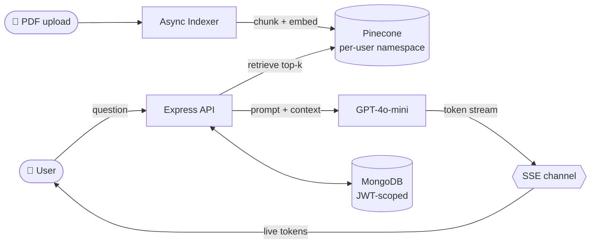

  

  

  
  
  
  
  

> 📬 **Open to AI Engineer roles** in Melbourne or remote across Australia.
> Reach me at **taoaaron5@gmail.com** — I usually reply within a day.

<h2 align="center">👋 whoami</h2>

**I build AI systems that ship — not demos.**

I'm Aaron, an AI Engineer in Melbourne 🇦🇺. **Monash CS · University of Melbourne IT · Australian PR.**
6+ production projects shipped — including [DocuMind](https://docu-mind-neon.vercel.app) (RAG SaaS) and an iOS app live on the App Store.

These days I'm obsessed with **multi-tenant RAG**, **streaming UX**, and **agent loops that don't hallucinate**.

<h2 align="center">🧭 How I build</h2>

- **Ship beats demo.** A v1 in production teaches more than a v3 in slides.
- **Numbers over adjectives.** "Fast" means nothing; `<400ms p95` does.
- **Architecture before code.** I draw the system before writing the first line.
- **AI-augmented, human-verified.** I lean on Claude Code daily, but I read every line that ships.

<h2 align="center">🎯 Now</h2>

Currently in **Melbourne 🇦🇺**, actively interviewing for AI Engineer roles. Building **SkillPath v2** (AI-powered personalized learning) on the side.

<h2 align="center">📚 Currently Learning</h2>

- 🤖 **AI Agents** — ReAct, LangGraph, agentic eval (foundation for SkillPath v2)
- 📖 *Designing Machine Learning Systems* — Chip Huyen
- 📖 *Building LLM Applications* — Hamel Husain (working notes)
- 📰 arxiv: weekly skim — recent: structured outputs, retrieval eval, prompt caching

<h2 align="center">⚡ Recent Activity</h2>

<!--START_SECTION:activity-->
<!--END_SECTION:activity-->

<i>Auto-updated every 6 hours via GitHub Actions.</i>

<h2 align="center">🛠 Tech Stack</h2>

  

  <b>MODELS</b>&nbsp;
  
  
  &nbsp;·&nbsp;
  <b>AI STACK</b>&nbsp;
  
  
  
  

<h2 align="center">🚧 Currently Building</h2>

  

  Building in public — designing the agent loop with RAG-augmented retrieval. v2 in active development.

  
  
  

<h2 align="center">💻 Featured Project</h2>

**🤖 [DocuMind](https://docu-mind-neon.vercel.app)** &nbsp;
AI-powered document Q&A SaaS — upload a PDF, ask questions, get answers with source citations using RAG.

### Architecture

**Highlights**
🔹 RAG pipeline: chunk → embed → vector search → GPT-4o-mini generation
🔹 Streaming responses via Server-Sent Events (token-by-token)
🔹 Multi-turn memory across last 6 exchanges
🔹 Per-user vector isolation with Pinecone namespaces
🔹 Async background indexing with startup cleanup for orphaned documents

**⚡ Key Engineering Challenges**
🔸 SSE protocol edge case — once HTTP headers are sent, normal error responses are impossible. Solved by detecting `res.headersSent` and pushing LLM crash errors down the open stream so the frontend never hangs mid-response
🔸 Multi-tenancy isolation at two layers: MongoDB queries filter by JWT-extracted `userId` (never user-supplied), Pinecone vectors isolated per-user namespace — delete is atomic (MongoDB first, Pinecone in try-catch) to prevent orphaned vectors on DB failure

**Tech:** React 19, Node.js/Express 5, MongoDB, Pinecone, OpenAI GPT-4o-mini, LangChain, Vercel/Render

<h2 align="center">🚀 More AI Work</h2>

  Selected from <b>38+ public repos</b> — more on <a href="https://www.aarontao.com/">aarontao.com</a>

<table align="center">
  <tr>
    <td valign="top" width="50%">
      <h3>🤖 <a href="https://github.com/HAONANTAO/ai-customer-support-system">ai-customer-support-system</a></h3>
      
LangChain-powered customer support agent in TypeScript.

      
      
    </td>
    <td valign="top" width="50%">
      <h3>💬 <a href="https://github.com/HAONANTAO/Mock_AI_ChatBot">Mock_AI_ChatBot</a></h3>
      
AI chatbot interface with custom prompt logic.

      
      
    </td>
  </tr>
  <tr>
    <td valign="top" width="50%">
      <h3>🧠 <a href="https://github.com/HAONANTAO/AI-Brain">AI-Brain</a></h3>
      
Obsidian-based AI knowledge vault — notes, prompts, learnings.

      
    </td>
    <td valign="top" width="50%">
      <h3>🛒 <a href="https://github.com/HAONANTAO/E-Commerce-Rabbit">E-Commerce-Rabbit</a></h3>
      
Full-stack MERN e-commerce — auth, cart, checkout, admin.

      
      
    </td>
  </tr>
</table>

  
  

<h2 align="center">🐍 Coding Trail</h2>

  <picture>
    <source media="(prefers-color-scheme: dark)" srcset="https://raw.githubusercontent.com/HAONANTAO/HAONANTAO/output/github-snake-dark.svg" />
    <source media="(prefers-color-scheme: light)" srcset="https://raw.githubusercontent.com/HAONANTAO/HAONANTAO/output/github-snake.svg" />
    
  </picture>

  <code>$ aaron --status=shipping --location=melbourne --version=2026</code>

  <a href="https://www.aarontao.com/">aarontao.com</a> · <a href="mailto:taoaaron5@gmail.com">taoaaron5@gmail.com</a>

