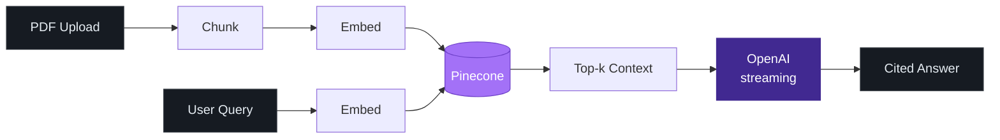

  

  

  
  
  
  

  <i>Open to AI engineering & full-stack roles · Melbourne or remote across Australia · Australian PR · PMP-certified</i>

<h2 align="center">DocuMind</h2>

  <i>Multi-tenant RAG SaaS — upload a PDF, ask questions, get streamed answers with inline citations.</i> 
  Built on <b>TypeScript</b> · <b>Pinecone</b> vector store · <b>OpenAI</b> embeddings + streaming completions.

  

  
  

<i>&nbsp;&nbsp;architecture &nbsp;·&nbsp; click to expand&nbsp;&nbsp;</i>

<h2 align="center">JD Analyzer</h2>

  <i>Chrome extension that scores your resume against any job description.</i> 
  Live on the Chrome Web Store · BYO OpenAI key, zero backend — all inference runs against the user's own key.

  

  <i>Full archive on <a href="https://www.aarontao.com/"><b>aarontao.com</b></a> · all repos on <a href="https://github.com/HAONANTAO?tab=repositories"><b>GitHub</b></a></i>

 

  <picture>
    <source media="(prefers-color-scheme: dark)" srcset="https://raw.githubusercontent.com/HAONANTAO/HAONANTAO/output/github-snake-dark.svg" />
    <source media="(prefers-color-scheme: light)" srcset="https://raw.githubusercontent.com/HAONANTAO/HAONANTAO/output/github-snake.svg" />
    
  </picture>

  <i>Aaron Tao &nbsp;·&nbsp; Melbourne 🇦🇺</i>

